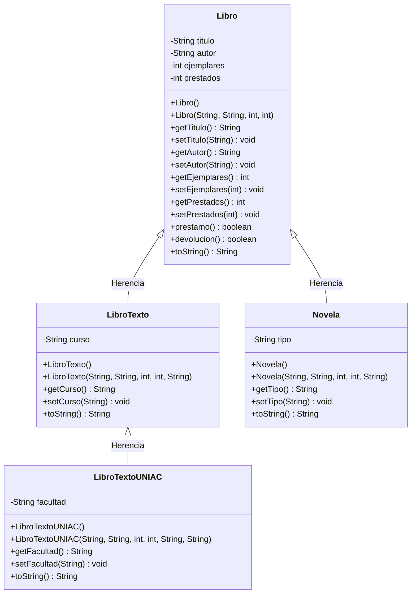

# Parcial I - Programación II

## Integrantes
- Kevin García

---

## Diagrama UML de Clases

    1. Situaciones donde NO se podría realizar la herencia 
Uso del modificador final en la clase base:

Si la clase base se define como public final class Libro, Java impedirá que cualquier clase (como LibroTexto o Novela) pueda heredar de ella, generando un error de compilación.

// Falla de compilación al intentar heredar:
public final class Libro { ... }

// Error: Cannot inherit from final 'com.biblioteca.Libro'
public class LibroTexto extends Libro { ... }

Constructores privados en la clase base sin un constructor accesible:

Si la clase Libro únicamente define constructores con visibilidad private, las subclases no podrán invocar super(...) desde sus propios constructores.

public class Libro {
    // Constructor privado
    private Libro(String titulo) {
        this.titulo = titulo;
    }
}

public class Novela extends Libro {
    public Novela(String titulo) {
        // Error: Libro() has private access in com.biblioteca.Libro
        super(titulo); 
    }
}

2. Propuesta de Nuevos Atributos y Método
Atributo 1: String isbn (Identificador único internacional del libro para un control de inventario preciso).

Atributo 2: double precio (Para calcular el valor comercial o costo de penalización por pérdida del ejemplar).

Método Adicional: public int consultarDisponibilidad()

Lógica: Retorna la cantidad de ejemplares disponibles para préstamo en sala (ejemplares - prestados).